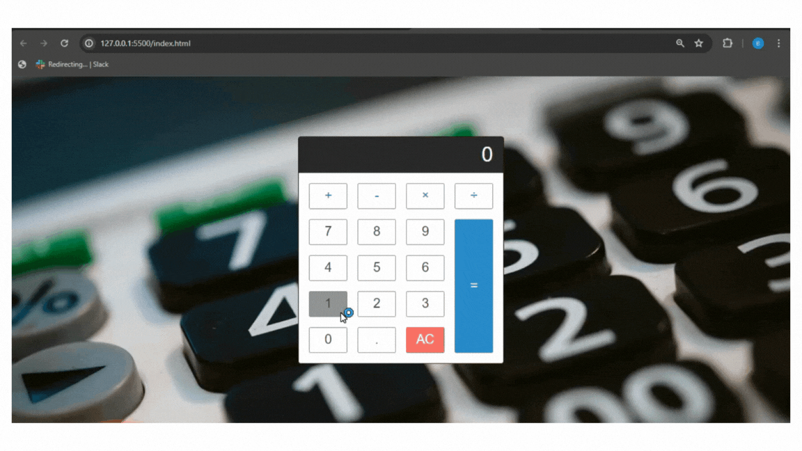

## HesapMakinesi

- Bu repo, modern web teknolojileri kullanılarak oluşturulan interaktif bir hesap makinesi uygulamasını içerir. Kullanıcı dostu arayüzü ve hızlı işlem yetenekleri ile matematiksel işlemleri kolayca yapmanızı sağlar. 

### Özellikler 

- Temel Matematik İşlemleri: Toplama, çıkarma, çarpma ve bölme. 

- Kullanıcı Dostu Arayüz: Her yaştan ve her seviyeden kullanıcılar için anlaşılır ve kullanışlı.

- Responsive Tasarım: Masaüstü, tablet ve mobil cihazlar üzerinde sorunsuz çalışır. 

### Teknolojiler 

- Bu uygulama, HTML5, CSS3 ve JavaScript kullanılarak geliştirilmiştir. Tasarım için modern CSS teknikleri ve JavaScript özellikleri kullanılmıştır.

### Gif 

